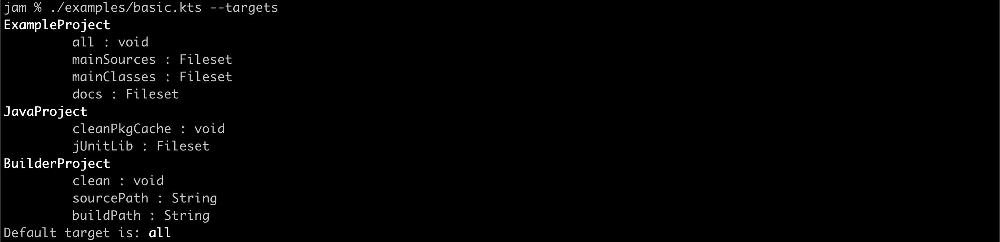
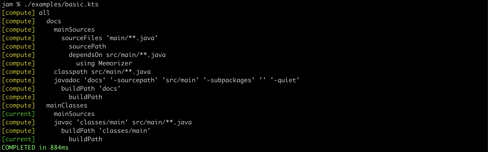
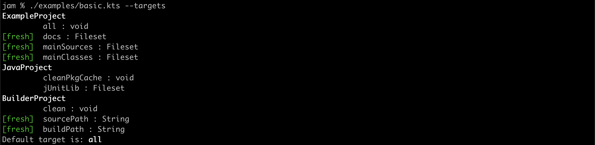
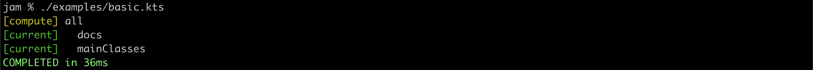
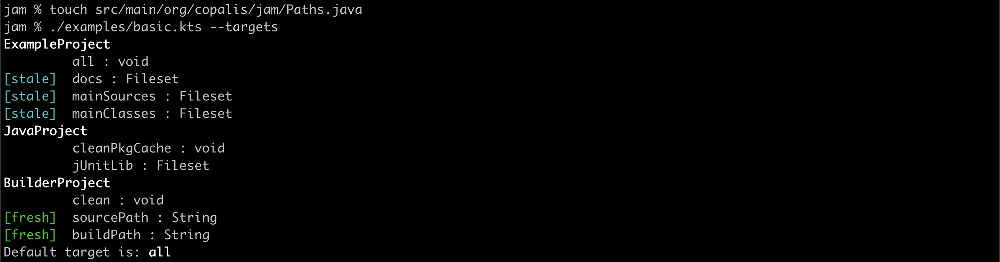
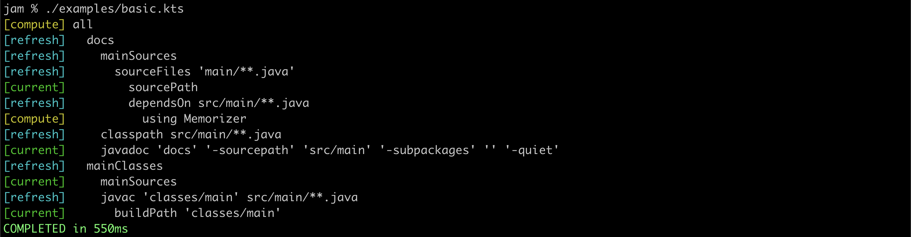

# Jam - A build tool that's Just a Memoizer

A lightweight library that lets you write command-line build scripts in plain Java or Kotlin code.
Jam provides command-line option handling, logging, and dependency tracking.


## How does it work?

Jam is fundamentally a memoizer: It intercepts method calls and caches the return values so that subsequent calls to the same method with the same parameters can be served from the cache rather than executing them again.
The cache is also saved to disk so that Jam can remember the project state between runs of the build script.

During the initial execution of uncached methods, Jam also records the methods' dependencies on external mutable resources like source files. If those resources change, Jam knows that the cached method result is now stale.

>Jam's memoizer has a `dependsOn()` method which is conceptually similar to `useState()` in React

Jam also provides console logging of all the instrumented methods, and standard handling for command-line options like `--help`.

### Example build scripts

Below are equivalent Kotlin and Java versions of a build script.

<details open>
<summary>Kotlin</summary>

File name: `basic.kts`

```kotlin
#!/usr/bin/env kotlin -Xjvm-default=all -cp jam.jar

interface ExampleProject : JavaProject {

    fun mainSources() = sourceFiles("main/**.java")

    fun mainClasses() = javac("classes/main", mainSources())

    fun docs() = javadoc("docs", "-sourcepath", classpath(mainSources()), "-subpackages", "", "-quiet")

    fun all() {
        docs()
        mainClasses()
    }
}

Project.run(ExampleProject::class.java, ExampleProject::all, args)
```

The script consists of:

1. A [shebang](https://en.wikipedia.org/wiki/Shebang_(Unix)) first line which invokes the Kotlin runtime to execute this script and specifies the location of `jam.jar`.
2. A *project interface*. This defines the build targets and build logic.
3. A final call to `Project.run(ExampleProject::class.java, ExampleProject::all, args)` which executes the build controller with the project interface, the default build target, and command-line arguments.
 
</details>
<details>
<summary>Java</summary>

File name: `basic-java`

```java
#!/usr/bin/java -classpath jam.jar --source 17

public interface ExampleProject extends JavaProject {

    default Fileset mainSources() {
        return sourceFiles("main/**.java");
    }

    default Fileset mainClasses() {
        return javac("classes/main", mainSources());
    }

    default Fileset docs() {
        return javadoc("docs",
                "-sourcepath", classpath(mainSources()),
                "-subpackages", "", "-quiet");
    }

    default void all() {
        docs();
        mainClasses();
    }

    static void main(String[] args) {
        Project.run(ExampleProject.class, ExampleProject::all, args);
    }
}
```
This script consists of:

1. The [shebang](https://en.wikipedia.org/wiki/Shebang_(Unix)) first line which invokes the Java runtime to execute this script and specifies the location of `jam.jar`.
2. A *project interface*. This defines the build targets and build logic.
3. A `main()` method which invokes the build controller by calling `Project.run(ExampleProject.class, ExampleProject::all, args)` with the project interface, default build target and command-line arguments.
 
</details>

To run a build script, invoke it by name from the command line, eg `./my-build-script.kts`.
You can also specify build targets or options as command-line arguments.
For example, `--targets` displays the build targets defined by the script. 



The `all`, `mainSources`, `mainClasses` and `docs` targets correspond to the 0-argument methods defined in the `ExampleProject` interface.

Additional build targets are inherited from parent interface `JavaProject` and its parent interface `BuilderProject`, including the `clean` target which deletes all build artifacts.

Ok, let's run this build:
 


When a build script is run without any arguments, the default target is executed, which in this case is `all`.

Jam displays all the function calls that occur within the project.
The first few lines show that the target function `all()` called `docs()` which called `mainSources()` which called `sourceFiles("main/**.java")`, etc.

Note that `sourceFiles()` calls `dependsOn()`. Like `useState()` in React, `dependsOn()` records a dependency on some external state. If that state changes, it means that any derived results or build artifacts are stale.

The memoization cache is persisted between runs of the build script. If we look at the build targets again:



The targets that were previously executed and had their results cached now have a `[fresh]` tag.
When the cached values are fresh, that means that build artifacts they refer to are also up to date.

Note: `void` methods are not cached.

If we run the build again:



The `all()` function is executed again because it's uncacheable,
but `docs()` and `mainClasses()` are both fresh and so do not have to be executed again.

## Dependency tracking

Let's use `touch` to mark a source file as updated, and then check the status of the build targets:



Three of the build targets are now marked as `[stale]`. 

> How it works:
One of the files referenced by the `Fileset` returned by `mainSources()` has been updated, which invalidates that cached result.
Because `mainSources()` was called by both `docs()` and `mainClasses()` Jam knows they have a dependency on that result, so their results are also stale.

Now if we run the build again, Jam will rebuild aka `[refresh]` the stale targets:
 


## More advanced build scripts

Take a look at Jam's own [build script](examples/make-jam.kts). This demonstrates how to:

* Use `resolve()` to download libraries from the Maven repository and use them as build dependencies
* Run unit tests with the `junit()` method
* Build jar files

## Tips

You may have noticed that the example build scripts have no `import` statements.
Types provided by Jam are declared in the default package so for common cases you don't need to clutter your build script with imports.

Source file paths are relative to the base directory `./src`,
and build functions like `javac()` accept paths that are relatve to the build artifacts base directory, which is `./build` by default.
To change these, override the `sourcePath()` and `buildPath()` methods.

The Jam cache file is stored in the current directory, and is given the name `.{project-interface-name}.ser`

Jam follows these conventions:

* `void` methods are not memoized, and should be used for logic that has side effects
* Non-void methods with 1 or more parameters are memoized, but cannot be specified as targets

Due to how Jam's memoizer is implemented, a project must follow these rules:

* The project definition must be an interface rather than a class
* The functions must be implemented as `default` methods
* In order to be saved in the result cache, parameters and return types must be primitive or serializable

## Building the Jam library

Building `jam.jar` requires JDK 17 or higher to be installed.

1. Compile the main classes by running `./setup`
2. Run `./make-jam` to compile Jam, run unit tests, and create JavaDocs and `jam-<version>.jar`
3. Alternatively, run the equivalent Kotlin build script: `./examples/make-jam.kts`

