# Jam build tool

**Jam** is a build automation library.
It lets you write build scripts in plain Kotlin or Java.

* Build *targets* are just methods/functions
* *Dependencies* between targets are inferred by Jam's dynamic method proxy, which monitors method parameters and return values for references to source files.

There are 3 parts to Jam:

1. A build controller that handles command-line arguments
2. A dynamic method proxy that memoizes result values and tracks dependencies
3. A library of utility functions for compiling code

## How does it work?

Jam's memoizer intercepts method calls and caches return values, including references to build artifacts. 
Later method calls with the same parameters are served from cache instead of the method being executed again.
The cache is also persisted to disk so that Jam can remember the project state between builds.
Jam also records methods' dependencies on external mutable resources like source files;
If those resources change, Jam knows that build artifacts derived from them are stale and marks cache entries referring to them as stale.

## Jam in action

### Jam scripts

Here is an example build script written in Kotlin. Kotlin scripts must have names that end with `.main.kts`.
This file is called `hello.main.kts`.

```kotlin
#!/usr/bin/env kotlin -Xjvm-default=all
@file:Repository("https://raw.githubusercontent.com/gilesjb/jam-repo/refs/heads/main")
@file:DependsOn("org.copalis:jam:0.9.1")

interface HelloWorld : JavaProject {

    fun worldStr() = "World"

    fun worldName() = read("world.txt")

    fun greet(place : String) = println("Hello, ${place}!")

    fun helloJava() = sourceFiles("HelloWorld.java")

    fun helloClasses() = classpath(javac("classes", helloJava()))

    fun runHello() {
        java("-cp", helloClasses(), "HelloWorld")
    }

    fun printHellos() {
        greet(worldStr())
        greet(worldName())
        runHello()
    }
}

Project.run(HelloWorld::class.java, HelloWorld::printHellos, args)

```

The script can be run directly from the command line.
It just requires Kotlin to be installed; the Jam library will be downloaded automatically.

Passing the `--help` option displays options:
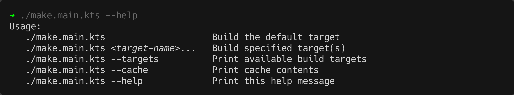

### Build targets

Specifying `--targets` shows the build targets
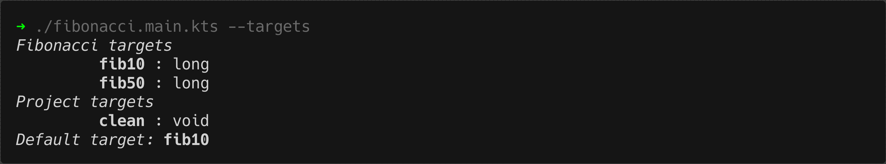
Targets are just project methods that have 0 arguments.
The target listing shows method defined by the script's `HelloWorld` interface and inherited from its parent interfaces.

Let's run the `worldStr` target:
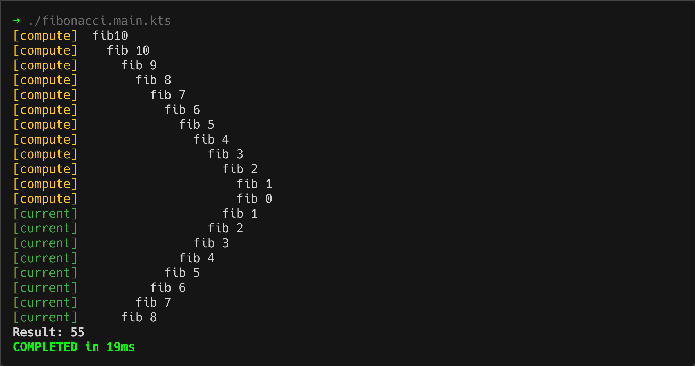
The output log shows that `worldStr()` was executed and returned the value "World".
 
Another target is `worldName`

Now the output log shows that `worldName()` was executed, and it in turn called `read("world.text")`

### Result caching

If we look at the targets again we can see that both `worldStr` and `worldName` targets are tagged as **fresh**.
This means that their results are cached and up to date.
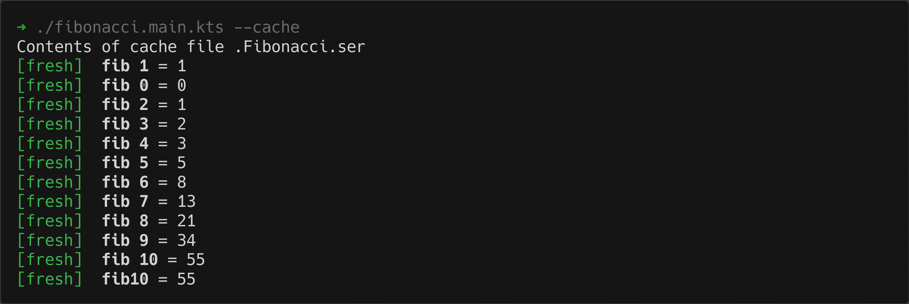

The cache contents can be viewed with the `--cache` option.
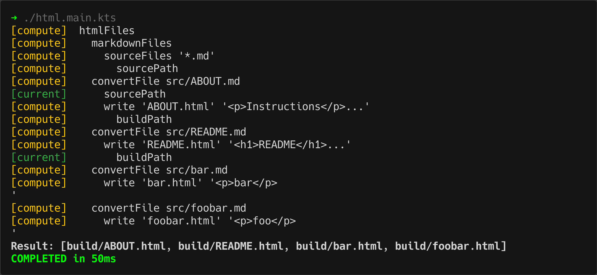
(Notice that the results cache is stored in a hidden file, and its name is derived from the project name.)

Because its result is cached, if we run `worldName` again the result will be fetched from cache.
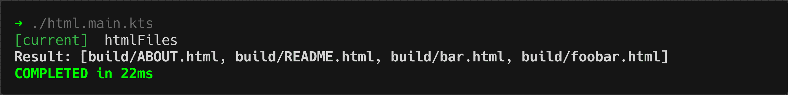

### Dependency tracking

Jam is able to infer that the result of `worldName` depends on the contents of the file `src/world.txt`.
This means that if the last-modified time of that file changes, the cached result will be invalidated.


Now the `worldName` target is shown as stale.
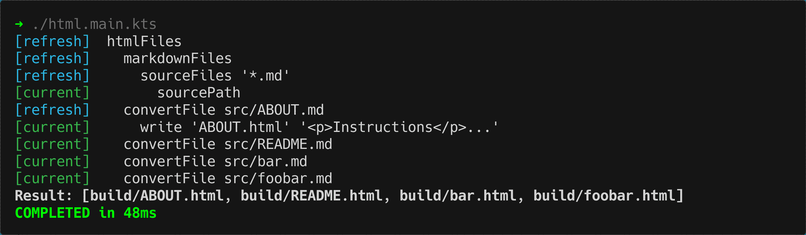

Executing the target again it will be rebuilt.
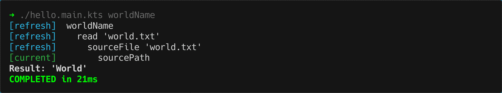

### Compiling code

The `JavaProject` interface provides a variety of methods for building and executing Java code.
This is demonstrated by the `runHello` target:
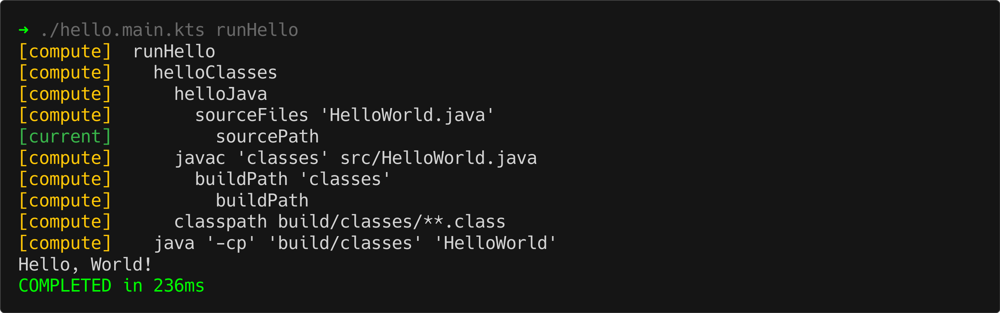

Jam stores references to the compiled classes.
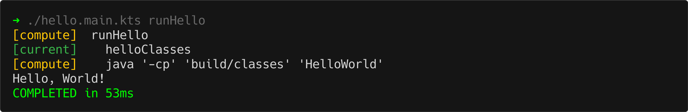

But if there are modifications to source files,


then Jam will recompile the classes.
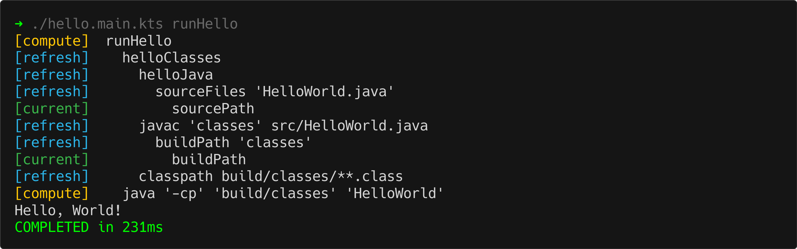

## Building Jam

The only build dependency of Jam is JDK17 or later.

* Clone the Jam repo
* Running `./setup` creates a build script called `make-jam` and builds the project
* `./make-jam viewDocs` will display the JavaDocs

