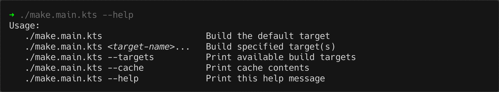
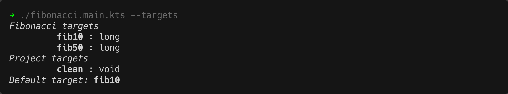
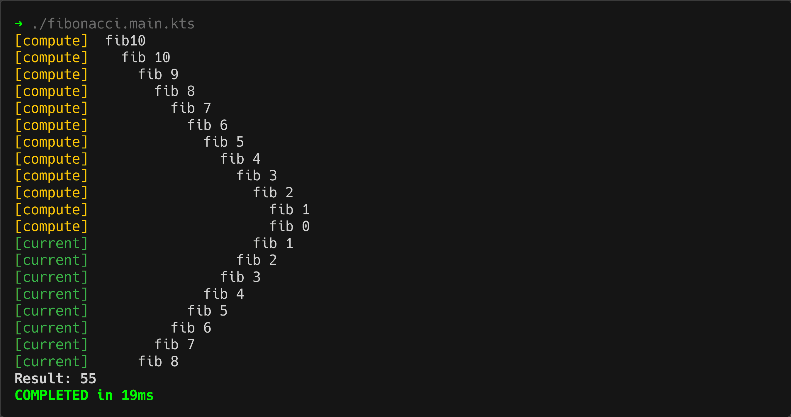
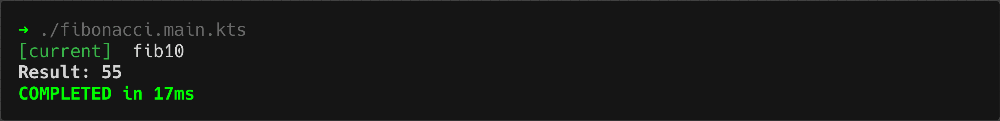
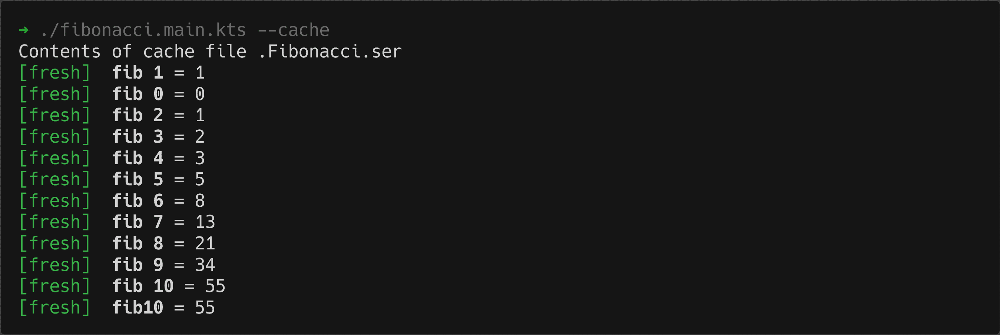
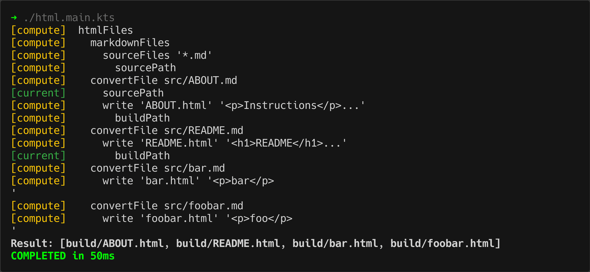
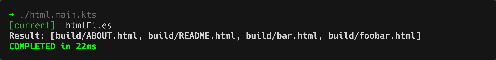
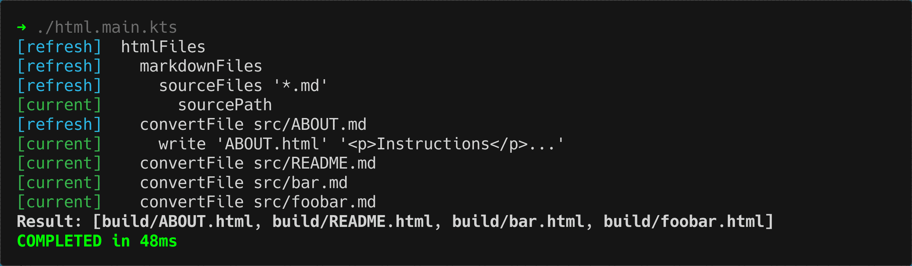

# Jam build tool

Jam is a JVM build tool which lets you write build scripts in plain Kotlin or Java. 
Build targets are just methods. 
Jam uses a dependency-tracking dynamic proxy to memoize method calls, giving you incremental builds automatically — no explicit dependency declarations required.
Jam supports incremental builds by memoizing (caching) method calls with a dependency-tracking dynamic proxy.

## An example Jam script

This is what a Jam build script for a simple Java project looks like:

```kotlin
#!/usr/bin/env -S kotlin -Xjvm-default=all

@file:DependsOn("org.copalis:jam:0.9.2")

interface DemoProject : JavaProject {

    fun dependencies() = resolve("com.google.code.gson:gson:2.10.1")

    fun mainSources() = sourceFiles("main/**.java")

    fun mainClasses() = javac("classes/main", mainSources(), "-cp", classpath(dependencies()))

    fun testSources() = sourceFiles("test/**.java")

    fun testClasses() = javac("classes/test", testSources(),
            "-cp", classpath(mainClasses(), jUnitLib(), dependencies()))

    fun tests() = junit("test/report",
            "--scan-classpath", classpath(testClasses()),
            "-cp", classpath(testClasses(), testSources(), mainClasses(), dependencies()))

    fun docs() = javadoc("docs", "-Xdoclint:none",
            "-sourcepath", classpath(mainSources()),
            "-cp", classpath(dependencies()),
            "-subpackages", "org.copalis")

    fun jarfile() = jar("jam-demo.jar", mainClasses())

    fun build() : File {
        tests()
        docs()
        return jarfile()
    }
}

Project.run(DemoProject::class.java, DemoProject::build, args)

```

Some things to note:

- **The shebang line** — `#!/usr/bin/env -S kotlin -Xjvm-default=all` means the script can be executed directly from the command line like a shell script. The `-Xjvm-default=all` flag is required for Jam's proxy mechanism to work with interface default methods.
- **`@file:DependsOn`** — uses Kotlin's built-in scripting mechanism for declaring dependencies to trigger an automatic download of the Jam library, so no manual installation is needed.
- **`DemoProject`** — the user-defined project, which must be an interface so that Jam can proxy its methods.
- **`JavaProject`** — a built-in Jam interface that provides standard methods for Java builds: `javac`, `junit`, `javadoc`, `jar`, `sourceFiles`, `classpath`, and Maven dependency resolution via `resolve`.
- **`dependencies()`** — a zero-parameter method, which makes it a *target* — something that can be invoked directly from the command line.
- **`testClasses()` being called twice in `tests()`** — this does *not* cause double compilation, because the second call is served from Jam's memoization cache.
- **`build()`** — the default target passed to `Project.run`, but any other target can be invoked by name from the command line.
- **`Project.run`** — this is where the script calls into Jam's build controller, which creates a proxied implementation of the project interface.

The build controller also handles command-line arguments like `--help`



## Try Jam out

If you have Kotlin installed you can easily try out this script.

```kotlin
#!/usr/bin/env -S kotlin -Xjvm-default=all

@file:DependsOn("org.copalis:jam:0.9.2")

interface Fibonacci : Project {

    fun fib(x : Long) : Long = if (x < 2) x else fib(x - 1) + fib(x - 2)

    fun fib10() = fib(10)
    fun fib50() = fib(50)
}

Project.run(Fibonacci::class.java, Fibonacci::fib10, args)

```

Save the code to a file called `fibonacci.main.kts` and make it executable with `chmod +x fibonacci.main.kts`.

Then type `./fibonacci.main.kts --targets` to see what build targets it exposes.



Note that the `fib` method is *not* listed as a target.
Jam project interfaces can contain methods with parameters, but only methods with 0 parameters are targets.

The default target is `fib10`. Let's run that.



The console log shows the method call tree

* `[compute]` means a method was executed
* `[current]` means a cached return value was reused

Because of the method memoization `fib` was only executed 11 times.

Let's see what happens if we run the script again.



This time no methods were executed because Jam reused the memoizer cache.
We can examine the contents of the cache by using the `--cache` option.



Try the other command-line options,
and also see what happens when you execute the `fib50` target.

## Mutable resources

We've seen how Jam caches return values across runs.
If a return value is a reference to a mutable resource like a file,
Jam can detect if the resource has been modified since the last run and mark the cached value as *stale*.
The next time a build target that depends on that resource is executed, 
Jam will re-execute the functions that depend on it.

This feature gives Jam build scripts the ability to automatically detect when source files have been changed,
and rebuild the artifacts that depend on them.

Let's see it in action. Here's a script that scans for Markdown files in the source directory (`src` by default)
and writes their HTML equivalents to the build directory:

```kotlin
#!/usr/bin/env kotlin -Xjvm-default=all

@file:DependsOn("org.copalis:jam:0.9.2")
@file:DependsOn("org.commonmark:commonmark:0.22.0")

interface MarkdownBuild : FileProject {
    
    fun markdownFiles() = sourceFiles("*.md")
    
    fun convertFile(input: File): File {
        val parser = org.commonmark.parser.Parser.builder().build()
        val renderer = org.commonmark.renderer.html.HtmlRenderer.builder().build()
        
        val dest = input.relativeTo(File(sourcePath())).path.replace(".md", ".html")
        return write(dest, renderer.render(parser.parse(input.readText())))
    }

    fun htmlFiles() = markdownFiles().map { convertFile(it) }
}

Project.run(MarkdownBuild::class.java, MarkdownBuild::htmlFiles, args)

```

Running a clean build


Running the build again

As expected, the build target is shown as `[current]`.

Let's simulate modifying one of the source files using the `touch` command


and run the build again

This time, the build target is shown as `[refresh]`.

* `[refresh]` means a method was executed because it depended on a resource that was modified since the last run

The log shows that `convertFile` was executed just for the file that was modified.

## More about Jam

If you want to write your own Jam scripts,
check out the [Project JavaDocs](https://gilesjb.github.io/jam/package-summary.html).

## Building Jam

Jam is able to build itself - see [Jam's own build script](src/scripts/JamProject.java),
depending only on JDK version 17 or later.

1. Clone the Jam repo
2. Type `./setup`

The built Jam jar will be in the `build` directory.

To view the JavaDocs type `./make-jam viewDocs`.
